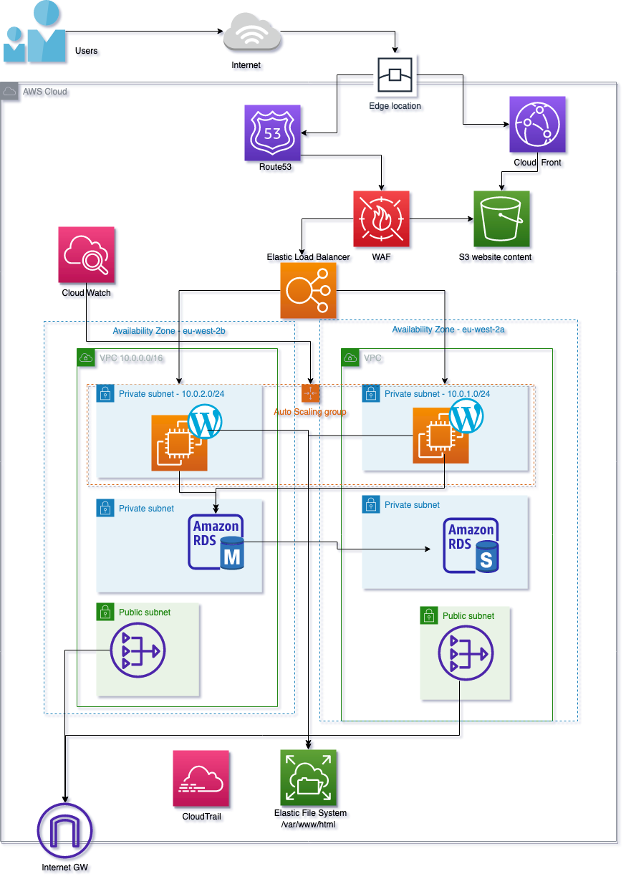

# About the Project

This Project was build using AWS services, terraform and ansible to create scalable wordpress website with database.

This setup uses AWS services such as S3, WAF, Route53, CloudFront, CloudWatch, VPC, ELB, ASG, NAT, EFS, and CloudTrail to deploy a highly available and secure Wordpress website.

# Architecture:  

## Wordpress Deployment on AWS

### Route53
- Users are directed to the nearest AWS Edge Location for a fast and seamless website experience. This is achieved by using Route53's geolocation-based routing.

### CloudFront
- CloudFront serves cached website content to users from the Edge Locations, reducing the website's loading latency. The service caches frequently accessed website content and serves it directly to users without the need to reach the application servers, improving website performance.

### WAF
- To secure the website and protect against attacks, the Web Application Firewall (WAF) is implemented. The WAF monitors and filters incoming traffic, blocking malicious requests and ensuring the website's security.

### ELB
- The Elastic Load Balancer distributes incoming traffic evenly to the two Wordpress application servers, located in separate Availability Zones for high availability. The ELB automatically monitors the health of the servers and redirects traffic to healthy servers, providing a seamless experience for users even in the event of a server failure.

### RDS (Master & Standby)
- The Wordpress servers use a highly available MySQL database managed by Amazon Relational Database Service (RDS). The Master RDS instance provides database services to the Wordpress servers, while a Standby RDS instance is available as a backup in case of failure. This ensures the continuity of database services even in the event of an outage.

### CloudWatch
- CloudWatch monitors the EC2 servers' CPU usage and triggers the Auto Scaling Group (ASG) to scale up or down as needed. If the CPU usage exceeds 60%, the ASG launches another instance to support the increased load. When the CPU usage drops below 20%, the ASG automatically terminates the instance to reduce costs.

### EFS
- The website files are stored in the Elastic File System (EFS), which integrates with AWS Backup for convenient backup and restore capabilities. The EFS provides a scalable and highly available file storage system, ensuring the website files are always accessible.

### NAT
- The Network Address Translation (NAT) service enables the private subnets to access resources and services from the internet while protecting them from external connections. The NAT service provides internet connectivity for the Wordpress servers, supporting the website's operation.

### CloudTrail
- CloudTrail logs user activity and events, providing a comprehensive view of AWS resource usage. This information can be used to improve the website's security posture, prove compliance with regulations, and troubleshoot issues.
